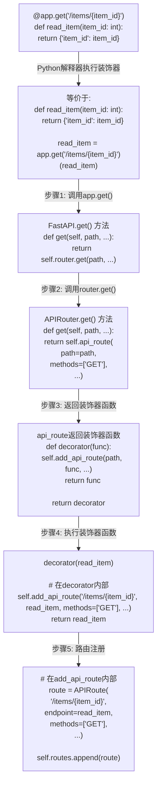
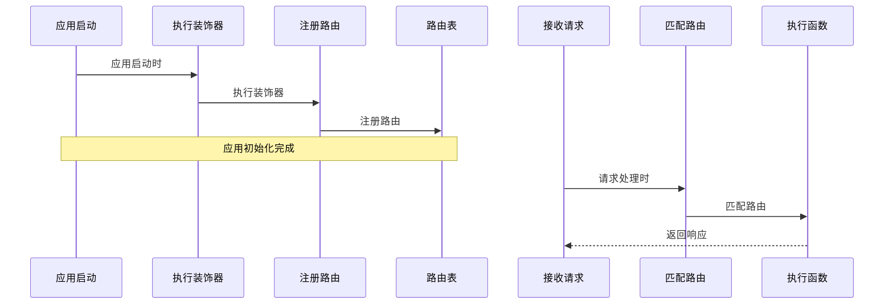
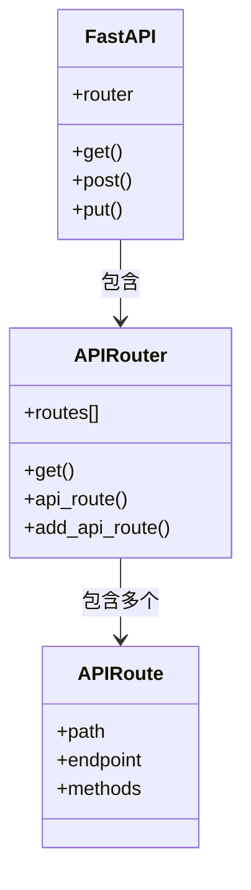

# FastAPI 装饰器工作原理 - Mermaid图解

## 装饰器执行流程图



## 时序图：装饰器执行时间



## 类图：装饰器与路由的关系



## 动手练习

尝试在你的FastAPI应用中添加不同的装饰器参数，观察其效果：

```python
@app.get(
    "/items/{item_id}",
    tags=["items"],
    summary="获取单个物品",
    response_description="物品信息",
    status_code=200
)
def read_item(item_id: int):
    return {"item_id": item_id}
```

在支持Mermaid的Markdown查看器中（如VS Code+Markdown预览或GitHub），以上图表会被渲染为美观的可视化图形。 